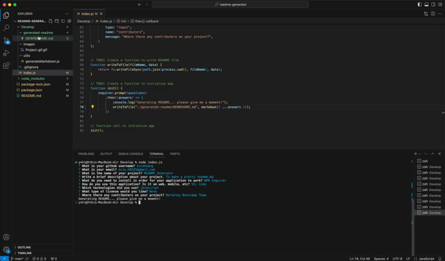

# README Generator


  ## Description 🗒️

  > A README file is an essential component of any software project, providing valuable information for developers, users, and collaborators. However, crafting a well-structured README can be time-consuming and error-prone. To simplify this task and ensure consistency, we can leverage the power of JavaScript to build a professional README generator.


  ## Licenses 🪪
  ```
  None
  ```

  ## Installations 💻
  ```
  None
  ```

  ## How To Use ✍️
  ```
  Launch on VS.Code and use!
  ```

  ## Technologies Used 🤖
  ```
  Javascript
  ```

  ## Contributors 🤖
  ```
* Berkeley Bootcamp Team for sourcecode
* [Inquirer](https://www.npmjs.com/package/inquirer) for documentation and processes.
* [NPMJS](https://www.npmjs.com/package/prompt) for documentation and processes.

  ## Author Info 🤸
  - GitHub: [Evie Hoang](https://github.com/eviehoang)
  - Email:  evie.h0325@gmail.com
